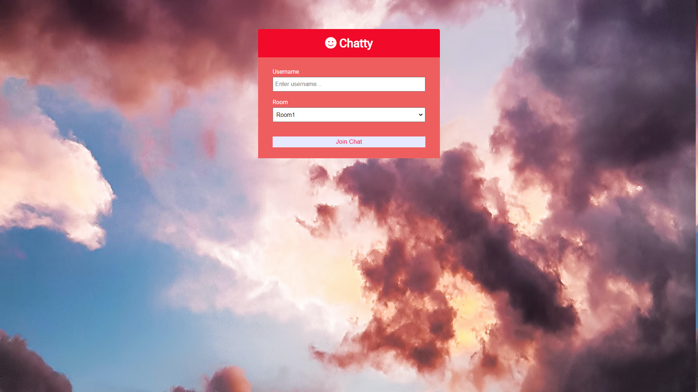
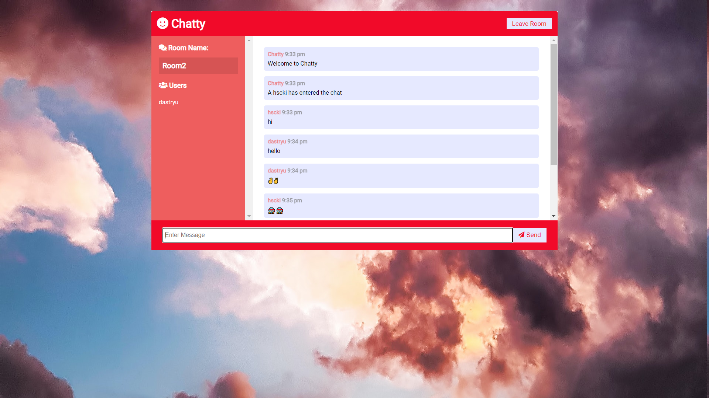

# Chatty-messaging-app
Chatty is "socket.io" based messaging app that is created using NodeJs and Express. It is client side web app so privacy is well maintained at both the end.One can join various room,have list of currentlly connected users and much more.Following are the screenshots of home page and chat terminal respectively.

# Home Page

# Chat terminal

# Running on localhost

- clone or download the "Chatty-messaging-app" repository.
- go to the "Chatty-messaging-app" directory and open cmd.
- run the command "npm init"
- to start the server run the command "npm run dev".
- goto http://localhost:3000/
- goto http://localhost:3000/ on another tab to send and receive messages.
